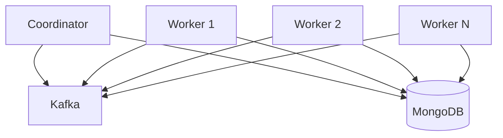

# FlowKit

FlowKit is a powerful flow orchestration toolkit that enables distributed task execution using a coordinator/worker architecture with Kafka as the message backplane.

## Key Features

- **Distributed Task Execution**: Coordinate complex workflows across multiple workers
- **Kafka-based Messaging**: Reliable, scalable communication between components
- **MongoDB Persistence**: Durable task state and artifact storage
- **Flexible DAG Support**: Define complex task dependencies and fan-in/fan-out patterns
- **Fault Tolerance**: Built-in retry mechanisms, worker failure detection, and task recovery
- **Streaming Processing**: Support for streaming data through pipeline stages
- **Testing Infrastructure**: Comprehensive test helpers for building reliable workflows

## Quick Example

```python
import asyncio
from flowkit import Coordinator, CoordinatorConfig, WorkerConfig
from flowkit.worker import Worker
from your_handlers import MyHandler

# Start a coordinator
async def main():
    # Configure and start coordinator
    coord_config = CoordinatorConfig()
    coordinator = Coordinator(db=your_mongo_db, cfg=coord_config)
    await coordinator.start()

    # Configure and start worker
    worker_config = WorkerConfig(roles=["processor"])
    worker = Worker(
        db=your_mongo_db,
        cfg=worker_config,
        handlers={"processor": MyHandler()}
    )
    await worker.start()

    # Create a task with a simple graph
    graph = {
        "nodes": [
            {
                "node_id": "process_data",
                "type": "processor",
                "io": {"input_inline": {"data": "hello world"}}
            }
        ],
        "edges": []
    }

    task_id = await coordinator.create_task(params={}, graph=graph)
    print(f"Created task: {task_id}")

if __name__ == "__main__":
    asyncio.run(main())
```

## Architecture Overview

FlowKit consists of three main components:

1. **Coordinator**: Orchestrates task execution, manages DAG scheduling, and monitors worker health
2. **Worker**: Executes individual tasks and reports progress back to coordinators
3. **Message Bus**: Kafka-based communication layer for reliable message delivery



## Getting Started

1. [Install FlowKit](getting-started/installation.md)
2. [Follow the Quick Start guide](getting-started/quickstart.md)
3. [Learn the basic concepts](getting-started/concepts.md)
4. [Explore examples](examples/simple-pipeline.md)

## Use Cases

- **ETL Pipelines**: Extract, transform, and load data across multiple stages
- **ML Workflows**: Orchestrate model training, validation, and deployment
- **Data Processing**: Handle large-scale data processing with fault tolerance
- **Microservice Orchestration**: Coordinate complex business processes
- **Event-Driven Architecture**: Build reactive systems with reliable message handling
